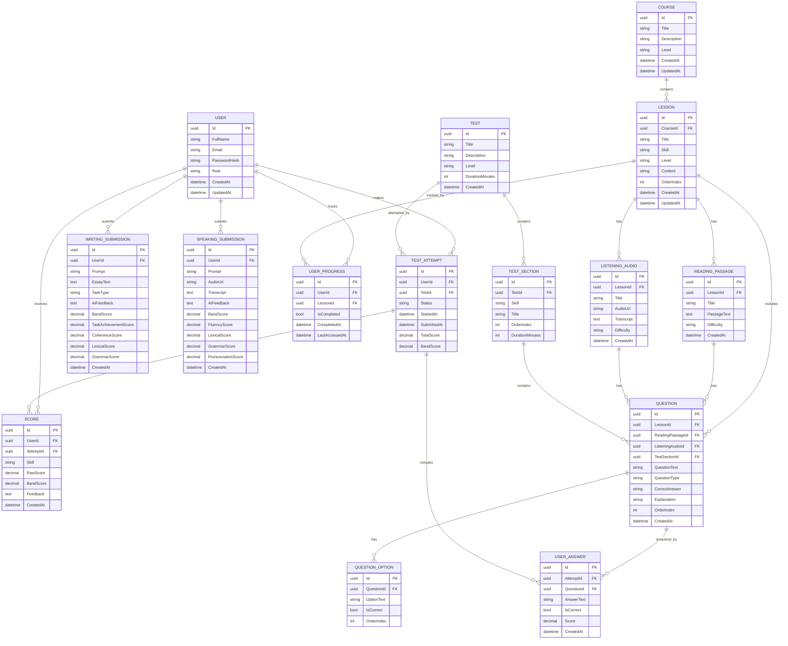

# IELTS Learning Platform — Backend Documentation & ERD

## 1. Project Overview

This project is an IELTS learning platform that helps users practice the four IELTS skills:

* Reading
* Listening
* Writing
* Speaking

The backend is designed using a **Modular Monolith Architecture** with ASP.NET Core Web API. Each main feature is separated into its own module inside the `Features` folder, while shared business entities are stored in `Domain` and technical implementations such as database, authentication, file storage, email, and AI services are stored in `Infrastructure`.

---

## 2. Main Goals

The platform should allow users to:

* Register and log in
* Learn IELTS lessons by skill
* Practice Reading and Listening questions
* Submit Writing essays
* Submit Speaking recordings or transcripts
* Take full IELTS-style tests
* View scores, feedback, and progress history
* Receive AI-powered feedback for Writing and Speaking

---

## 3. Architecture Style

Recommended architecture:

```txt
Modular Monolith + Clean-style separation
```

### Why this architecture?

* Easier to build than microservices
* Clean enough for a portfolio and real-world project
* Easy to scale later
* Good fit for ASP.NET Core Web API
* Each feature can be maintained independently

---

## 4. Folder Structure

```txt
Ielts.Api/
├── Common/
│   ├── Constants/
│   ├── Exceptions/
│   ├── Extensions/
│   ├── Helpers/
│   ├── Middlewares/
│   └── Responses/
│
├── Domain/
│   ├── Entities/
│   │   ├── User.cs
│   │   ├── Course.cs
│   │   ├── Lesson.cs
│   │   ├── ReadingPassage.cs
│   │   ├── ListeningAudio.cs
│   │   ├── Question.cs
│   │   ├── QuestionOption.cs
│   │   ├── Test.cs
│   │   ├── TestSection.cs
│   │   ├── TestAttempt.cs
│   │   ├── UserAnswer.cs
│   │   ├── WritingSubmission.cs
│   │   ├── SpeakingSubmission.cs
│   │   ├── Score.cs
│   │   └── UserProgress.cs
│   │
│   ├── Enums/
│   │   ├── IeltsSkill.cs
│   │   ├── QuestionType.cs
│   │   ├── LessonLevel.cs
│   │   ├── AttemptStatus.cs
│   │   └── SubmissionStatus.cs
│   │
│   └── ValueObjects/
│
├── Features/
│   ├── Auth/
│   ├── Users/
│   ├── Courses/
│   ├── Lessons/
│   ├── Reading/
│   ├── Listening/
│   ├── Writing/
│   ├── Speaking/
│   ├── Questions/
│   ├── Tests/
│   ├── Attempts/
│   ├── Progress/
│   └── AI/
│
├── Infrastructure/
│   ├── Data/
│   │   ├── AppDbContext.cs
│   │   ├── Configurations/
│   │   └── Seed/
│   │
│   ├── Auth/
│   ├── Storage/
│   ├── Email/
│   └── ExternalServices/
│
├── Migrations/
├── Program.cs
├── appsettings.json
└── Ielts.Api.csproj
```

---

## 5. Core Modules

### 5.1 Auth Module

Responsible for:

* Register
* Login
* JWT generation
* Password hashing
* Current user profile

Example endpoints:

```txt
POST /api/auth/register
POST /api/auth/login
GET  /api/auth/me
```

---

### 5.2 Courses Module

Responsible for IELTS course grouping.

Example:

* IELTS Beginner Course
* IELTS Band 6.5 Course
* IELTS Writing Task 2 Course

Example endpoints:

```txt
GET    /api/courses
GET    /api/courses/{id}
POST   /api/courses
PUT    /api/courses/{id}
DELETE /api/courses/{id}
```

---

### 5.3 Lessons Module

Responsible for normal learning content.

Each lesson belongs to one course and one IELTS skill.

Example lesson skills:

* Reading
* Listening
* Writing
* Speaking
* Vocabulary
* Grammar

Example endpoints:

```txt
GET    /api/lessons
GET    /api/lessons/{id}
POST   /api/lessons
PUT    /api/lessons/{id}
DELETE /api/lessons/{id}
```

---

### 5.4 Reading Module

Responsible for reading passages and reading-specific exercises.

A Reading Passage can have many questions.

Common IELTS Reading question types:

* Multiple Choice
* True / False / Not Given
* Yes / No / Not Given
* Matching Headings
* Matching Information
* Sentence Completion
* Summary Completion
* Short Answer

Example endpoints:

```txt
GET  /api/reading/passages
GET  /api/reading/passages/{id}
POST /api/reading/passages
```

---

### 5.5 Listening Module

Responsible for listening audio, transcripts, and listening questions.

A Listening Audio can have many questions.

Example endpoints:

```txt
GET  /api/listening/audios
GET  /api/listening/audios/{id}
POST /api/listening/audios
```

---

### 5.6 Writing Module

Responsible for Writing Task 1 and Task 2 submissions.

The system can store:

* Prompt
* User essay
* AI feedback
* Estimated band score
* Task achievement score
* Coherence and cohesion score
* Lexical resource score
* Grammar score

Example endpoints:

```txt
POST /api/writing/submit
GET  /api/writing/submissions/me
GET  /api/writing/submissions/{id}
```

---

### 5.7 Speaking Module

Responsible for Speaking Part 1, Part 2, Part 3 practice.

The system can store:

* Speaking prompt
* Audio file URL
* Transcript
* AI feedback
* Estimated band score

Example endpoints:

```txt
POST /api/speaking/submit
GET  /api/speaking/submissions/me
GET  /api/speaking/submissions/{id}
```

---

### 5.8 Tests Module

Responsible for full IELTS-style tests.

A Test contains multiple sections:

* Reading section
* Listening section
* Writing section
* Speaking section

Example endpoints:

```txt
GET  /api/tests
GET  /api/tests/{id}
POST /api/tests
```

---

### 5.9 Attempts Module

Responsible for user attempts.

A user can start a test, submit answers, and receive a score.

Example endpoints:

```txt
POST /api/attempts/start
POST /api/attempts/{attemptId}/answers
POST /api/attempts/{attemptId}/submit
GET  /api/attempts/me
```

---

### 5.10 Progress Module

Responsible for tracking user progress.

The platform can track:

* Completed lessons
* Test attempts
* Average band score
* Weak skills
* Study streak

Example endpoints:

```txt
GET /api/progress/me
GET /api/progress/me/summary
```

---

### 5.11 AI Module

Responsible for AI-powered features.

Possible AI features:

* Writing feedback
* Speaking feedback
* Answer explanation
* Question generation
* Personal tutor chat
* Weakness analysis

Example endpoints:

```txt
POST /api/ai/writing-feedback
POST /api/ai/speaking-feedback
POST /api/ai/explain-answer
POST /api/ai/generate-questions
```

---

## 6. Entity Design

### 6.1 User

Stores account information.

Important fields:

```txt
Id
FullName
Email
PasswordHash
Role
CreatedAt
UpdatedAt
```

---

### 6.2 Course

Stores course information.

Important fields:

```txt
Id
Title
Description
Level
CreatedAt
UpdatedAt
```

---

### 6.3 Lesson

Stores lesson content.

Important fields:

```txt
Id
CourseId
Title
Skill
Level
Content
OrderIndex
CreatedAt
UpdatedAt
```

---

### 6.4 ReadingPassage

Stores IELTS reading passage content.

Important fields:

```txt
Id
LessonId
Title
PassageText
Difficulty
CreatedAt
```

---

### 6.5 ListeningAudio

Stores IELTS listening audio content.

Important fields:

```txt
Id
LessonId
Title
AudioUrl
Transcript
Difficulty
CreatedAt
```

---

### 6.6 Question

Stores questions for lessons, passages, listening audio, or test sections.

Important fields:

```txt
Id
LessonId
ReadingPassageId
ListeningAudioId
TestSectionId
QuestionText
QuestionType
CorrectAnswer
Explanation
OrderIndex
CreatedAt
```

---

### 6.7 QuestionOption

Stores options for multiple-choice questions.

Important fields:

```txt
Id
QuestionId
OptionText
IsCorrect
OrderIndex
```

---

### 6.8 Test

Stores full IELTS-style tests.

Important fields:

```txt
Id
Title
Description
Level
DurationMinutes
CreatedAt
```

---

### 6.9 TestSection

Stores sections inside a test.

Important fields:

```txt
Id
TestId
Skill
Title
OrderIndex
DurationMinutes
```

---

### 6.10 TestAttempt

Stores a user's test attempt.

Important fields:

```txt
Id
UserId
TestId
Status
StartedAt
SubmittedAt
TotalScore
BandScore
```

---

### 6.11 UserAnswer

Stores answers submitted by users.

Important fields:

```txt
Id
AttemptId
QuestionId
AnswerText
IsCorrect
Score
CreatedAt
```

---

### 6.12 WritingSubmission

Stores writing task submissions.

Important fields:

```txt
Id
UserId
Prompt
EssayText
TaskType
AiFeedback
BandScore
TaskAchievementScore
CoherenceScore
LexicalScore
GrammarScore
CreatedAt
```

---

### 6.13 SpeakingSubmission

Stores speaking practice submissions.

Important fields:

```txt
Id
UserId
Prompt
AudioUrl
Transcript
AiFeedback
BandScore
FluencyScore
LexicalScore
GrammarScore
PronunciationScore
CreatedAt
```

---

### 6.14 Score

Stores detailed scoring records.

Important fields:

```txt
Id
UserId
AttemptId
Skill
RawScore
BandScore
Feedback
CreatedAt
```

---

### 6.15 UserProgress

Tracks lesson completion and user learning progress.

Important fields:

```txt
Id
UserId
LessonId
IsCompleted
CompletedAt
LastAccessedAt
```

---

## 7. ERD Diagram



---

## 8. Recommended Database Tables

```txt
users
courses
lessons
reading_passages
listening_audios
questions
question_options
tests
test_sections
test_attempts
user_answers
writing_submissions
speaking_submissions
scores
user_progress
```

---

## 9. Important Relationships

### User to TestAttempt

One user can have many test attempts.

```txt
User 1 --- many TestAttempt
```

### Course to Lesson

One course can have many lessons.

```txt
Course 1 --- many Lesson
```

### Lesson to ReadingPassage

One lesson can have many reading passages.

```txt
Lesson 1 --- many ReadingPassage
```

### Lesson to ListeningAudio

One lesson can have many listening audio records.

```txt
Lesson 1 --- many ListeningAudio
```

### Question to QuestionOption

One question can have many options.

```txt
Question 1 --- many QuestionOption
```

### Test to TestSection

One test contains many sections.

```txt
Test 1 --- many TestSection
```

### TestAttempt to UserAnswer

One attempt contains many submitted answers.

```txt
TestAttempt 1 --- many UserAnswer
```

---

## 10. Suggested API Design

### Auth

```txt
POST /api/auth/register
POST /api/auth/login
GET  /api/auth/me
```

### Courses

```txt
GET    /api/courses
GET    /api/courses/{id}
POST   /api/courses
PUT    /api/courses/{id}
DELETE /api/courses/{id}
```

### Lessons

```txt
GET    /api/lessons
GET    /api/lessons/{id}
POST   /api/lessons
PUT    /api/lessons/{id}
DELETE /api/lessons/{id}
```

### Reading

```txt
GET    /api/reading/passages
GET    /api/reading/passages/{id}
POST   /api/reading/passages
PUT    /api/reading/passages/{id}
DELETE /api/reading/passages/{id}
```

### Listening

```txt
GET    /api/listening/audios
GET    /api/listening/audios/{id}
POST   /api/listening/audios
PUT    /api/listening/audios/{id}
DELETE /api/listening/audios/{id}
```

### Questions

```txt
GET    /api/questions
GET    /api/questions/{id}
POST   /api/questions
PUT    /api/questions/{id}
DELETE /api/questions/{id}
```

### Tests

```txt
GET    /api/tests
GET    /api/tests/{id}
POST   /api/tests
PUT    /api/tests/{id}
DELETE /api/tests/{id}
```

### Attempts

```txt
POST /api/attempts/start
POST /api/attempts/{attemptId}/answers
POST /api/attempts/{attemptId}/submit
GET  /api/attempts/me
GET  /api/attempts/{id}
```

### Writing

```txt
POST /api/writing/submit
GET  /api/writing/submissions/me
GET  /api/writing/submissions/{id}
```

### Speaking

```txt
POST /api/speaking/submit
GET  /api/speaking/submissions/me
GET  /api/speaking/submissions/{id}
```

### AI

```txt
POST /api/ai/writing-feedback
POST /api/ai/speaking-feedback
POST /api/ai/explain-answer
POST /api/ai/generate-questions
```

### Progress

```txt
GET /api/progress/me
GET /api/progress/me/summary
```

---

## 11. MVP Feature Scope

For the first version, do not build everything at once.

Recommended MVP:

```txt
1. Auth
2. Courses
3. Lessons
4. Reading practice
5. Listening practice
6. Attempts
7. Basic score calculation
```

After MVP:

```txt
8. Writing submission
9. AI writing feedback
10. Speaking submission
11. AI speaking feedback
12. Progress dashboard
```

---

## 12. Recommended Tech Stack

### Backend

```txt
ASP.NET Core Web API
Entity Framework Core
PostgreSQL
JWT Authentication
FluentValidation
Swagger
```

### Frontend

```txt
Next.js
TypeScript
Tailwind CSS
React Query
```

### AI Service

```txt
OpenAI API or local LLM
Optional Python FastAPI microservice later
```

### Storage

```txt
Local storage for development
Cloud storage for production
```

Possible production options:

```txt
AWS S3
Cloudinary
Firebase Storage
Azure Blob Storage
```

---

## 13. Development Roadmap

### Phase 1 — Backend Foundation

```txt
- Create ASP.NET Core Web API project
- Add PostgreSQL connection
- Add EF Core
- Add modular folder structure
- Add global exception middleware
- Add API response wrapper
```

### Phase 2 — Auth

```txt
- Register
- Login
- JWT
- Password hashing
- Role-based authorization
```

### Phase 3 — Content System

```txt
- Courses CRUD
- Lessons CRUD
- Reading passages CRUD
- Listening audio CRUD
- Questions CRUD
```

### Phase 4 — Practice System

```txt
- Start attempt
- Submit answers
- Auto mark objective questions
- Store answer history
- Return result and explanation
```

### Phase 5 — Writing and Speaking

```txt
- Writing submission
- Speaking submission
- Store feedback
- Store band score
```

### Phase 6 — AI Features

```txt
- AI writing feedback
- AI speaking feedback
- AI answer explanation
- AI learning suggestion
```

### Phase 7 — Progress Dashboard

```txt
- Completed lessons
- Band history
- Weak skill detection
- Recommended next lesson
```

---

## 14. Notes for Implementation

### Keep controller thin

Controllers should only receive request, call service, and return response.

Bad:

```txt
Controller contains database logic and business logic
```

Good:

```txt
Controller → Service → DbContext
```

### Use DTOs

Do not expose entity directly in every API response. Use DTOs for request and response.

### Use enums

Use enums for fixed values:

```txt
IeltsSkill
QuestionType
LessonLevel
AttemptStatus
```

### Use UTC time

For PostgreSQL with EF Core, store timestamps in UTC to avoid DateTime issues.

### Start simple

Do not add microservices at the beginning. Build the modular monolith first. Split AI service later if needed.
